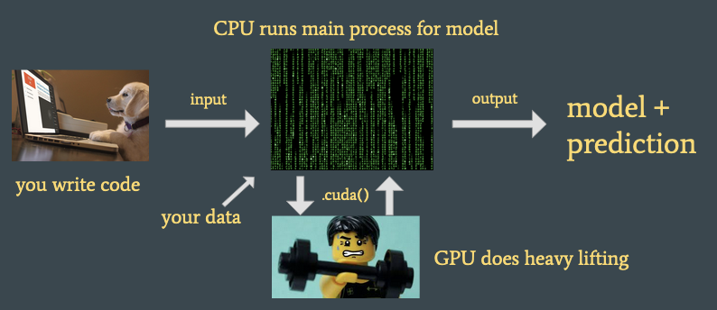
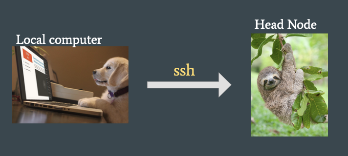
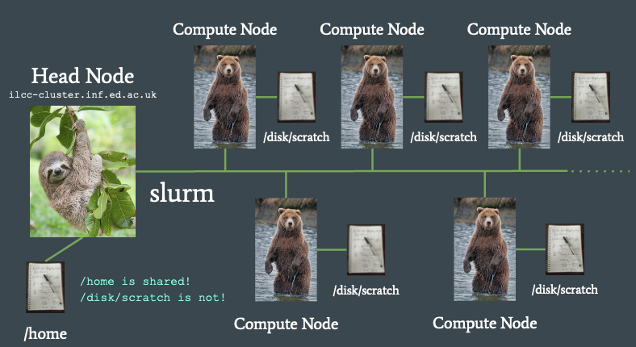

 # Using GPUs for NLP in Informatics: Notes
#### 12th October 2022

### Preface
The following guide is an attempt to codify everything I need to say during the CDT in NLP introductory cluster talk. Despite giving this talk 8+ times since 2020, there is a lot to go over and the session frequently runs over. As new students typically have a range of skill/knowledge level on the topic - some have felt left behind by the talk and demo. Hopefully, this written version will be useful for new students wishing to revise and learn to use the cluster and can follow these notes at their own pace.

If you have any feedback then email me at [tom.sherborne@ed.ac.uk](mailto:tom.sherborne@ed.ac.uk). 

---

## Getting Started

---
### Machine Learning demands many calculations

```
>>> import torch
>>> a = torch.randn((1024,512))
>>> b = torch.randn((2048,1024))
>>> torch.matmul(b,a)
# Approximately 1B operations!
```
CPUs have few, high power processing cores.
On a CPU, each product must be calculated sequentially leading to slow processing and sometimes intractable training. 

Each operation is a relatively simple instruction so can this be sped up?
- Can we delegate processing to many smaller processing cores?
- Consider sequential vs parallel operations
	- If 100 people are each buying 1 item in a shop…
		- is 1 checkout faster than 100?
		- 1 would be OK if 1 person bought 100 items.

---

### What is a GPU?

- GPUs enable rapid parallel processing of operations. 
- Many small cores working in parallel rather than few, large CPU cores. 
- ~4300 cores means less concurrency constraints!
- Useful for graphical tasks and gaming but now a must-have tool for Machine Learning and Scientific Computing.
- Intel have a good summary [here](https://www.intel.com/content/www/us/en/products/docs/processors/what-is-a-gpu.html).
---

### Working with GPUs

```
>>> import torch
>>> a = torch.randn((1024,512))
>>> b = torch.randn((2048,1024))
>>> torch.matmul(b,a)
7.39s to compute 1000x
>>> a = a.cuda()
>>> b = b.cuda()
>>> torch.matmul(b,a)
2.36s to compute 1000x
```

- We use the [NVIDIA CUDA](https://developer.nvidia.com/cuda-zone) interface to integrate GPUs into our code.

- All our code today is in [PyTorch](https://pytorch.org/) which plugs into CUDA without us writing GPU instructions. Other options exist like [TensorFlow](https://www.tensorflow.org/) if desired.

- Write code as if a CPU operation and then move matrices to the GPU for speed up.


- GPUs have their own memory. 
	- This is different to the RAM on your computer.
	- Small models can fit entirely on a GPU (not BERT!)
	- Or process data through a GPU model in batches. 
	- Need multiple GPUs? We will look at this later...

---

### Workflow



1. You write your experimental code. This might train a model, or just probe a pre-trained model (up to you).

2. Your model will take some input features (data, prompts etc.) and the CPU on the computer will co-ordinate the main process and data loading.

3. The controller will delegate processes to the GPU to do the heavy lifting matrix operations (this is controlled by you using the `.cuda()` or `.to(gpu)` functions).

4. The GPU will return the relevant outputs from the GPU operations back to the CPU controller (e.g. model outputs)

5. The end result of training might be model weights (a set of binary files determining parameter settings) and/or predicted outputs. 

---
### A Typical Experiment Outline

```
#!/bin/bash
1. Create folders, check data and environment

2. Train model using GPU

3. Generate predictions and scores from test set

4. Cleanup from experiment

5. Done!
```

- A model training experiment can be automated into a shell-script to complete setup, training, inference and cleanup. 

- This is for after model development, when you are confident that your model operates as intended.

- Formatting your experiments as a script makes migrating to clusters easy!

---

## What is a cluster?

---

### Cluster Introduction

- An arrangement of servers to execute computationally intensive work on dedicated high-performance machines in the background. 

- You log into the head node, format your experiments and then submit scripts as "jobs". 

- Your jobs are assigned a compute node (with a GPU) which runs your script and accesses a shared or local file system for data. 

- Jobs are assigned, managed and controlled using a scheduler program.

- Informatics uses the Slurm scheduler. 

---

### Why use a cluster?

#### Single GPU experiments

- ✅ Debug models during development with direct shell access to model e.g. using PDB

- ❌ GPU also required to run monitor and other processes. 

- ❌ One experiment at a time.

- ❌ Computer possibly not usable during experiments.

#### Cluster experiments

- ❌ No direct access to shell. Hard to debug errors .

- ✅ GPU dedicated to your experiment.

- ✅ Run many parallel experiments.

- ✅ Sharing GPUs maximises usage without grinding your own PC to a halt.

---

### What do we have in Informatics?

#### ILCC cluster: `ilcc-cluster.inf.ed.ac.uk` / `escience6`

- `~`80 GPUs for your work

- A combination of NVIDIA RTX2080 Ti and NVIDIA RTX1080 Ti cards with 11GB memory

- Each machine titled from a combination of naming schema (Scotland, Nobel Prize Winners...)

- One very large storage disk (`ostrom`) connected by NFS

#### PGR Cluster: `mlp.inf.ed.ac.uk`

 - Crannog[01-07] 	each has 4xA40s (48GB GPU memory) and 515GB RAM. 

 - Damnii[1-12] 		each has 7/8 RTX 2080s (11 GB memory) and 190GB RAM.

 - ~123 GPUs for use between all PGR students.

 - Other partitions (e.g., `Teach-Standard`) are used by others and _sometimes_ shared. e.g., `landonia` machines have some A6000s.
 
##### Aside:
- EIDF is a new resource to be demo’d in Second Semester (uses a Docker/Kubernetes system)
- Some CDT-NLP students will refer to CSD3. This is no longer available through the CDT

---

### Use `ssh` to access the head node



Using the terminal you can log in to the cluster head node like so: 

```
ssh ${USER}@ilcc-cluster.inf.ed.ac.uk

ssh ${USER}@mlp.inf.ed.ac.uk

ssh ${USER}@${cluster_name}.inf.ed.ac.uk
```

If you are not correctly authenticated (e.g. outside the EdLAN network) then you will likely want to request a Kerberos ticket first. See [here](https://computing.help.inf.ed.ac.uk/kerberos) for help on this. 

---

### Cluster Diagram



---

### Disk spaces on the cluster

- Like DICE, you will have a home folder as `/home/${USER}/`
- Move data between machines using `rsync` or `scp`.
- Your user space is on a network disk that all nodes can access.
	- `/home/` is actually `/disk/nfs/ostrom`
	- 168TB disk shared between all users. Keep results and environments here.
	- This disk is large but also slow. 
	- Keep your access during experiments minimal. 
	- This file system is not load-balanced. Too much file IO may break everything.
	- There are no backups! Got important work? Copy it out of the cluster.

- Each compute node has a local disk drive at `/disk/scratch/`
	- This is fast to read and write to during an experiment. 
	- Save weights and large file here during training. 
	- Copy what you need back to your user space at the end of your job. 
	- Delete everything you haven’t stored from here at the end of your job.

---

### Slurm commands

- `sbatch` - submit a job for hands-off execution on the cluster.

- `srun` - request an interactive shell session on a compute node (for debugging)

- `squeue` - check the execution of your jobs and the queue of waiting jobs

- `sinfo` - check cluster information

- `scontrol` - update job configuration (won’t be covering today)

---

### `sbatch`


1. You SSH onto the head node.

2. Submit your job using sbatch.

3. Slurm assigns the job to a compute node and then executes the job in the background.

---

### `srun`


1. Slurm assigns you an interactive session on the compute node (like SSHing directly to the node).

2. Useful if your job is going wrong somewhere/debugging.

3. No automatic processing and job is not a background process (hogs the GPU).

---

### Comparing `sbatch` and `srun`

#### `sbatch`

- ✅ Your experiment runs as a background process without direct supervision. 

- ✅ Run all your experiments in parallel on compute nodes.

- ✅ The intended use case for cluster computing.

- ✅ Go home and rest. Your work is happening while you sleep!

#### `srun`

- ✅ Gives you an SSH-like session on a compute node. Useful if something has gone wrong and you need to check your model on the cluster.

- ❌ Hoards GPU resources if used excessively. 

- ❌ The cluster becomes less useful and effective (we want 100% usage).

- ❌  Encourages poor experiment design and babysitting your jobs.

---

### Everything all together...

- Assume that experiments are bash scripts that specify all steps of computation.

- We access a cluster by SSHing on to the head node.

- Submit an experiment job using sbatch to request a compute node to run the job.

- Slurm manages the allocation, execution and running of jobs.

---

## Cluster workflow

---

### Anatomy of an `sbatch` script

```
1. #SBATCH Args here....

2. conda activate pt
 
3. rsync data /home/ to /disk/scratch/

4. python train.py

5. python predict.py

6. rsync results /disk/scratch/ to /home/${USER}/

7. rm -rf /disk/scratch/${USER}/exp
```

For your experiments you will need:

1. Slurm configuration
2. A Python environment
3. Training and test data 
4. The model to train (`model.py`)
5. Training command (`train.py`)
6. Prediction command (`predict.py`)

---

### Conda Environments

- Miniconda provides isolated runtime environments for your Python code. This manages your packages so you can be sure what dependencies you are using in your programme. 

- Install a specification of packages to an environment and use it for all your experiments! 

- Different experiments have different specifications? Use a different environment!

- We will install tools such as PyTorch in an environment. 

---

### Data Transfer

Initially, everything you need will be in `/home/${USER}/`. This includes your **`conda` environment**, **source code** and **input data**. 

1. During experimental startup you will copy your **input data** from `/home/${USER}/` to `/disk/scratch/${USER}/`

2. Your experiment will run accessing the **`conda` environment** and **source code** from `/home/${USER}/` and the **input data** from `/disk/scratch/${USER}/`. 

	**Output files** such as model weights and prediction artifacts will be saved to `/disk/scratch/${USER}/`. 

	Log files from Slurm will be saved to the designated location in `/home/${USER}/`. 

3. Upon completion, you will copy the **output** files from `/disk/scratch/${USER}/` to `/home/${USER}/` to save all your outputs from the experiment in the **distributed file system**.

4. You will finally cleanup by **removing** the **output files** from `/disk/scratch/${USER}/`.

---

### Software to use

There is no GUI access directly to the cluster. 

For writing code:
- Vim
- emacs
- Jupyter

For moving files (either from your own machine to head node, or head node to compute node)
- `rsync` (highly recommended)
- `scp`
- Git Large File Storage
- `wget` for downloading from the Internet.

Version control:
- Git + Github or Gitlab

Environments:
- Conda
- VirtualEnv
- Poetry (more experimental)
- Singularity is newly supported (experimental)

**New**:

- You can use the remote access feature of `VSCode` or `PyCharm Professional` to edit code on the cluster. But make sure you are still using proper version control to track your code and experiments. 

---

### Experiment checklist

- ☑️ A working model pushed to GitHub (or other VCS) to clone from

- ☑️ Code and data in my `/home/$USER/` folder on the shared file system

- ☑️ A conda environment to run my Python code within

- ☑️ I know how much RAM and GPUs I need

- ☑️ Bash script defining the stages of the experiment, config and data transfer.

---

### Workflow Recap

| On your local computer...

1. Write your code and get it working with a conda virtual environment

2. Version control your code with git and put it in a repository online with GitHub

| On the head node... 

3. Download your code by cloning repo from GitHub

4. Create identical conda environment

5. Get your input data onto the DFS e.g. scp / rsync / wget / LFS

| On a compute node...

6. Test your code on an srun interactive session

7. Last minute code edits on command line editors like vim or emacs

| Back on the head node... 

8. Run ALL YOUR JOBS with sbatch


---

## Now what?

---

### Getting help

1. `#computing` in the CDT in NLP Slack
	- Peer support from other users
	- Also useful if you want to help other people out!
	- I (Sherborne), am not in this Slack org.

2. [Submit Tickets to Computing Support](https://www.inf.ed.ac.uk/systems/support/form/) 🎫
	- Try and be as specific as possible. 
	- What do you think is the error? 
	- What have you tried to fix the error?
	- What compute node (i.e where) did the error occur?
	- Is it reproducible? 
	- What Slurm job # caused this?

3. `#cluster` channel in the EdinburghNLP Element (Experimental in 2022)
	- New platform for communication in EdinburghNLP
	- Managed by [Pasquale Minervini](http://www.neuralnoise.com/) -- email to get access. 

---

### Cluster etiquette

- Be nice!

- Running a lot of jobs? Consider staggering so many users can use the queue

- Or use Array jobs (not covered today but included in the demo) 

- If you see someone misbehaving then consider emailing them (they may be unaware)

- Similarly, another user may notify you if they see a process of yours acting improperly (e.g. running Python on the head node)

---

### The cluster-scripts repository

Helper repo [here](https://github.com/cdt-data-science/cluster-scripts)

- Scripts to make your life simply sublime
- Examples for quick learns
- Templates for running experiments fast
- We will use this in today’s demonstration!

---

### Common mistakes

**Conda environment not set up properly to use a GPU?**

	Check `torch.cuda.is_available()==True` in an interactive session.

**Training fails due to Out Of Memory errors?**

	Consider adjusting batch sizes to reduce peak GPU memory.
	Or reformat your model to use multiple GPUs. 

**Nothing happens when I submit using sbatch?**

	Check your SBATCH arguments. SBATCH will fail silently if the arguments contain an error.

**My job stops after a few seconds?**

	The `/disk/scratch` of a compute node might be full. Identify the node and submit a ticket!

---

### Not covered today

 - Using EIDF cluster: Many GPUs and resources but an entirely different experiment paradigm. To be explained in Semester 2

 - CSD3 Cluster: No longer supported by CDT. You may get access through your supervisor.


 - Multi GPU jobs: More complex in the past but tools like HuggingFace Trainer / Mosaic Composer can seamlessly use all available GPUs. Remember to adjust your jobs TCP port.

 - Using singularity in a Slurm job: Computing Support have a help page for this: https://computing.help.inf.ed.ac.uk/singularity


 - Using Array jobs: an example of this is in the Demo on Friday

---

### Demonstration

- See the [Quick Start Guide](./ilcc_cluster_quick_start_13_9_22.md) for getting set up.
- We will look at how to add to the queue and interact with the cluster.
- The README from `/cluster-scripts/experiments/examples/nlp/` covers the demo content. See [here](https://github.com/cdt-data-science/cluster-scripts/blob/master/experiments/examples/nlp/README.md).
- Demo of getting a [simple](../experiments/examples/nlp/simple_experiment.sh) and [advanced](../experiments/examples/nlp/advanced_experiment.sh) job set up.

