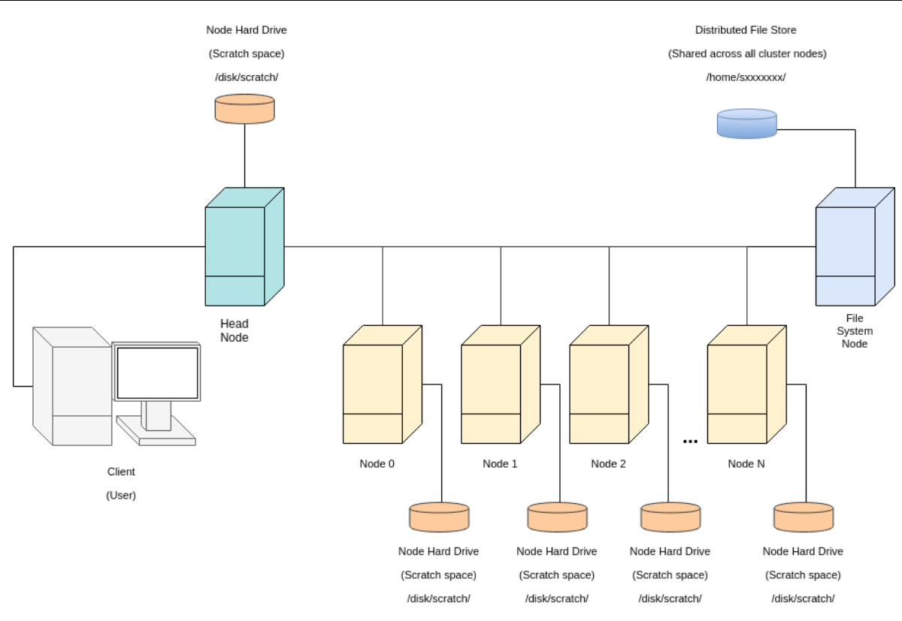

# Using GPUs for Machine Learning: Quick Start
## 3rd March 2022
### Tom Sherborne (adapted from James Owers)

This guide explains how to:
 - Log on to the cluster
 - Set up your bash environment
 - Set up a conda environment manager
 - Get some useful student written scripts
 - Provides examples of
	 - Interactive sessions with and without a GPU (srun)
	 - Running scripts on the cluster non-interactively (sbatch)
 - Set up jupyter notebooks to run on the cluster, but be easily accessible from anywhere

 ## First Steps 

The rest of this guide is designed to help you understand how you can use the cluster but we will cover most of this material in the talk. You can think of this document as a written version of most of what will be covered but not everything. 

__At a minimum, it would be very helpful if you can do these 3 tasks prior to the talk:__

 1. Check you can SSH into mlp.inf.ed.ac.uk. This will probably need to be from a DICE machine or a machine within the Informatics VPN (setup help for this is below). 
    - If you cannot access this machine, please file a [Support ticket](https://www.inf.ed.ac.uk/systems/support/form/). You’ll be limited during the talk if you cannot experience the cluster for yourself.
    - If you are not comfortable with shell access then read this [MIT guide](https://missing.csail.mit.edu/) for shells and [here](https://www.digitalocean.com/community/tutorials/how-to-use-ssh-to-connect-to-a-remote-server) for SSH.
 2. Clone the [cluster-scripts](https://github.com/cdt-data-science/cluster-scripts) repository into your own workspace using Git.
    - We will use resources within this repository during the session so make sure you have it now. 
    - Run the following code line in the directory where you want these scripts to live (usually the top-level directory)
    ```
    git clone https://github.com/cdt-data-science/cluster-scripts
    ```
 3. Install Anaconda within the cluster:
    - The clusters can’t use the same environment as DICE, so you need to reinstall this for `mlp.inf.ed.ac.uk`.
    - More details are below but the gist is these two lines:
    ```
    wget https://repo.continuum.io/miniconda/Miniconda3-latest-Linux-x86_64.sh 
    bash Miniconda3-latest-Linux-x86_64.sh
    ```
    - Installing Conda can be _very_ slow, so please get this done before we start.


## Important things to note first


This is an approximate setup of how the cluster is arranged for the CDT cluster (`albert`). The PGR Cluster we are using today is set up similarly.

- The initial node you log into is called the __head node__ (named `mlp` at the time of writing) - __do not__ run heavy processes on here. This node is only used for sending jobs to other nodes in the cluster
- The filesystem you have access to when you log in is identical on all the nodes you can access - it is a __distributed__ filesystem. As such, it is very slow (because it must appear the same everywhere)!
    - Avoid reading and writing files frequently on this filesystem
    - Instead, when running a job on a node, use its scratch disk and only move files to the shared filesystem infrequently. The scratch disk is located at `/disk/scratch` normally.
- Please skim read this for best practice: http://computing.help.inf.ed.ac.uk/cluster-tips


## Quick Bash Environment Setup

1. Find the name of your cluster. For example, it may be `cdtcluster`, `mlp`, `ilcc-cluster`, see http://computing.help.inf.ed.ac.uk/cluster-computing for more. Throughout this guide I will assume you have either set a variable called CLUSTER_NAME (or you'll just replace that in the instructions) e.g `CLUSTER_NAME=mlp`.
2. Run this line to SSH into the cluster: `ssh ${USER}@${CLUSTER_NAME}.inf.ed.ac.uk`
3. Create a Bash profile file so that the correct Bash setup runs when you login:
    - `touch .bash_profile`
    - Open the `.bash_profile` file and paste the following code into it. If we are using Vim:
        - `vim .bash_profile`
        - Press the `i` button so that you can insert text into the file (you'll see the word INSERT at the bottom of the screen)
        - Paste:
        ```
        if [ -f ~/.bashrc ]; then
            source ~/.bashrc
        fi
        ```
        - Press ESC then `!wq` to exit Vim.
4. Install miniconda3:
    - Download and run Miniconda installer
    ```
    wget https://repo.continuum.io/miniconda/Miniconda3-latest-Linux-x86_64.sh 
    bash Miniconda3-latest-Linux-x86_64.sh
    ```
    - Accept the licensing terms during installation.

5. Install the `cluster-scripts` repository containing useful scripts and the demos.
    - Git clone to your cluster user space
    ```
    git clone https://github.com/cdt-data-science/cluster-scripts
    cd ./cluster-scripts
    ```
    - __Follow the instructions in `README.md`__
6. Re-source your Bash profile
    ```
    source ~/.bashrc
    ```
7. You can now play around with commands on the cluster (try running `free-gpus`, `cluster-status`)
8. You should be ready to go!


## What's Next? Practical examples!

You can head straight to the cluster-scripts experiments repository here: 
https://github.com/cdt-data-science/cluster-scripts/tree/master/experiments
where you will find templates and practical examples to get you going. 

There are further examples below to try afterwards.


## Further examples
All the examples below expect you have performed the prior setup.

### Setup 
#### Create a conda environment with PyTorch

Make the conda environment. This can take a bit of time (it’s harder for the distributed filesystem to deal with lots of small files than for your local machine’s hard drive) - go get a cup of tea.

1. Check local versions of cuda available - at time of writing cuda 10.1 is available: `ls -d /opt/cu*`. You should use this version for the `cudatoolkit=??.?` argument below.
2. Run the command to create a conda environment called `pt`:
    `conda create -n pt python=3 pytorch torchvision cudatoolkit=10.1 -c pytorch`  (more info about PyTorch installation here if this goes wrong: https://pytorch.org/get-started/locally/)
3. Activate the environment `conda activate pt`

#### Get some code to run mnist experiments.
Get some code to run mnist in pytorch and run it:
 - `mkdir ~/projects`
 - `cd ~/projects` 
 - `git clone https://github.com/pytorch/examples.git`

##### Interactive jobs (without a gpu)
1. Get an interactive session (you shouldn’t do processing on the head node)
     - Find partitions which are used for Interactive sessions (they'll have interactive in the name). For example:
     ```
    $ sinfo -o '%R;%N;%l' | column -s';' -t
    > PARTITION          NODELIST                           TIMELIMIT
    > Teach-Interactive  landonia[01,03,25]                 2:00:00
    > …
    > PGR-Interactive    damnii01                           2:00:00
    > …
     ```
     - Use srun to get an interactive session on that partition. For example: 
     ```
    srun --partition=PGR-Interactive --time=08:00:00 --mem=8000 --cpus-per-task=4 --pty bash
    ```
2. Run example MNIST code:
    - `cd ~/projects/examples/mnist`
    - `conda activate pt`
    - `python main.py`

Please note: this is going to download data to the Distributed Filesystem (i.e. in your current working directory) and the code will access the data from there: this is not good practice on this cluster (because it will be very slow) and it will be changed in this guide at some point in the future - best practice says to store and access data in the scratch space of the node you’re running on

3. Exit your interactive session by running `exit`

##### Interactive jobs (without a gpu)
1. Launch a similar `srun` command using the `gres` command to request a GPU in your job:
    ```
    srun --partition=PGR-Interactive --time=08:00:00 --mem=14000 --cpus-per-task=4 --gres=gpu:1 --pty bash
    ```
2. Run example MNIST code:
    - `cd ~/projects/examples/mnist`
    - `conda activate pt`
    - `python main.py`

3. Exit your interactive session by running `exit`

##### Batch Jobs (non-interactive)

Repeat the above but this time using an sbatch script (non-interactive session). The command `sbatch` has many of the same arguments as `srun`, for example, add `--gres=gpu:1` if you would like to use one gpu

- `cd ~/projects/examples/mnist`
- create a bash script, `mnist_expt.sh`, for slurm to run:
    ```
    #!/usr/bin/env bash
    conda activate pt
    python main.py
    ```
 - Run this script by running: `sbatch --time=08:00:00 --mem=14000 --cpus-per-task=4 --gres=gpu:1 mnist_expt.sh`
 - Observe your job running with: `squeue` 
 - You can get information about your jobs with `jobinfo -u s1234567` (replace `s1...` with your username)
 - Check out the log file with `cat slurm-*.out`. This will be in the working directory you were inside when you ran the `sbatch` command.

## Useful Documentation and Links

### Computing support
 - Main page: http://computing.help.inf.ed.ac.uk/cluster-computing
 - Explanation of filesystem, and best practice: http://computing.help.inf.ed.ac.uk/cluster-tips
### Slurm docs
 - Quick start: https://slurm.schedmd.com/quickstart.html
 - sbatch: https://slurm.schedmd.com/sbatch.html
 - srun: https://slurm.schedmd.com/srun.html
 - array jobs: https://slurm.schedmd.com/job_array.html
### Other:
 - Setting up VPN for self managed machines/laptops: http://computing.help.inf.ed.ac.uk/openvpn
 - Logging in to the informatics machines remotely: http://computing.help.inf.ed.ac.uk/external-login


## Example `.bashrc` file

You can keep one, `~/.bashrc`, and make an additional` ~/.bash_profile` that just runs the `~/.bashrc` (as we did earlier). This file should get run every time you log in. Different files get run depending on whether you’re logging in interactively, or non interactively to a login or non-login shell. For more information, see: https://www.gnu.org/software/bash/manual/html_node/Bash-Startup-Files.html. For more information about bash start-up files for DICE machines, see http://computing.help.inf.ed.ac.uk/dice-bash. 

This is an example `~/.bashrc` you can use as guidance. 

```
# Allow resourcing of this file without continually lengthening path         
# i.e. this resets path to original on every source of this file
if [ -z $orig_path ]; then
  export orig_path=$PATH
else
  export PATH=$orig_path
fi

# This is so jupyter lab doesn't give the permission denied error
export XDG_RUNTIME_DIR=""

# This part is added automatically by the conda installation ================
# >>> conda initialize >>>
# !! Contents within this block are managed by 'conda init' !!
__conda_setup="$('/home/${USER}/miniconda3/bin/conda' 'shell.bash' 'hook' 2> /dev/null)"
if [ $? -eq 0 ]; then
    eval "$__conda_setup"
else
    if [ -f "/home/${USER}/miniconda3/etc/profile.d/conda.sh" ]; then
        . "/home/${USER}/miniconda3/etc/profile.d/conda.sh"
    else
        export PATH="/home/${USER}/miniconda3/bin:$PATH"
    fi
fi
unset __conda_setup
# <<< conda initialize <<<

conda activate
# ===========================================================================

# environment variable for your AFS home space
export AFS_HOME=/afs/inf.ed.ac.uk/user/${USER:0:3}/$USER

# Add cluster-scripts to path for easy use (explained in README)
export PATH=/home/${USER}/projects/cluster-scripts:$PATH
source /home/${USER}/projects/cluster-scripts/job-id-completion.sh

# Useful auto args for ls
alias ls='ls --color=auto'
alias ll='ls -alhF'
```